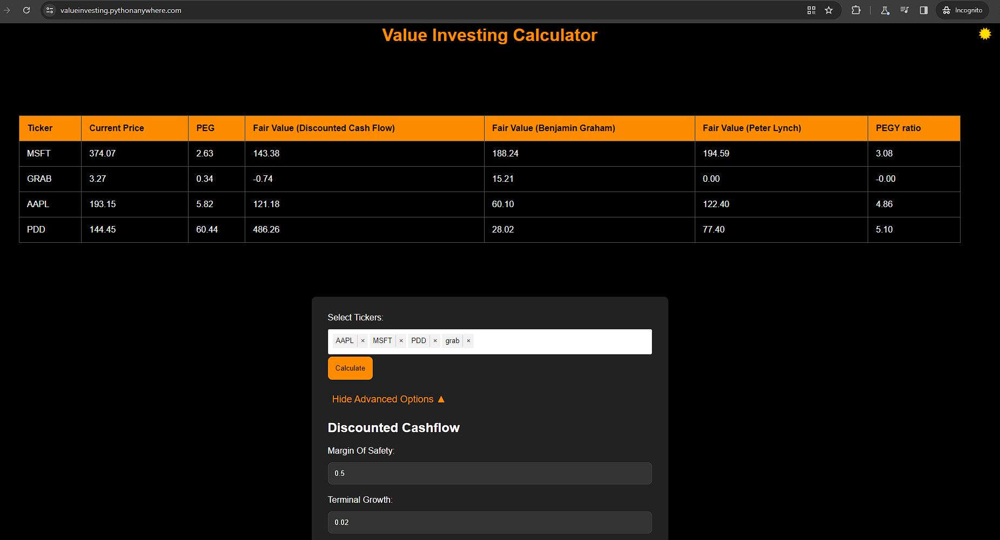

# Value Investing Calculator

Welcome to the Value Investing Calculator! This tool allows you to perform stock valuation using four different models based on the tickers provided. 

Give it a try at:
https://valueinvesting.pythonanywhere.com/

## Features

1. **Ticker Selection:**
   - Enter the stock tickers you want to evaluate. The tool supports multiple tickers separated by commas.

2. **Valuation Models:**
   - The calculator provides four types of valuation models to analyze and estimate the fair value of the selected stocks.
   - Note: Some tickers may not be supported as yahoo finance does not provide the necessary financial info(i.e BTC-USD). If a ticker is not supported, the calculator will skip the valuations and just show the current price.

3. **Parameter Toggle:**
   - Toggle between different parameters to customize the valuation models according to your preferences. Adjust parameters to see how they impact the fair value calculation.

4. **Comparison:**
   - Compare the calculated fair value with the current market price to determine if a stock is overvalued or undervalued.

## How to Use

1. **Enter Tickers:**
   - In the Ticker input field, enter the stock tickers of interest.

2. **Adjust Parameters:**
   - Toggle parameters such as PEG Ratio, margin of safety and others to customize the valuation models.

3. **Calculate:**
   - Click the "Calculate" button to initiate the valuation process based on the selected tickers and parameters.

4. **Review Results:**
   - View the calculated fair values for each stock and compare them with the current market prices.

## Models Overview

1. **Model 1: Discounted Cash Flow (DCF)**
    - DCF Fair Value = Sum of Future Cash Flows / (1 + Discount Rate) ^ Number of Years
    

2. **Model 2: Benjamin Graham Formula**
    - Ben Graham Fair Value = Earnings per Share * (8.5 + 2g)
    - g = Growth Rate of Earnings 

3. **Model 3: Peter Lynch Forumla**
    - Peter Lynch Fair Value = {Net Income Growth Rate} * {Earnings per Share} * {PEG}

4. **Model 4: PEGY Ratio**
    - PEGY Ratio = P/E Ratio / (EPS Growth Rate + Dividend Yield)
    Higher is Better

## Additional Information

- The calculator uses real-time financial data to perform the valuation. Ensure a stable internet connection for accurate results.
- Keep in mind that stock valuation is a complex process, and results should be used as part of a comprehensive analysis.

Feel free to explore different models, adjust parameters, and gain insights into the fair value of your selected stocks. Happy investing! 📈✨

